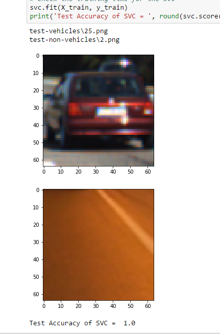
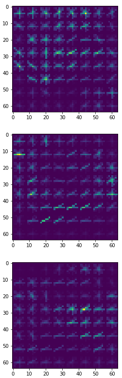
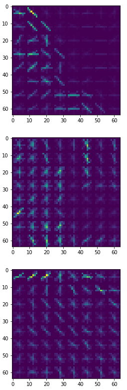
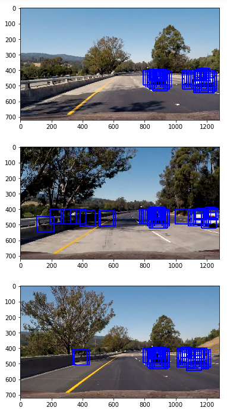
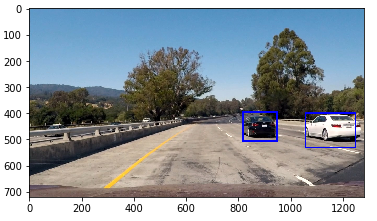
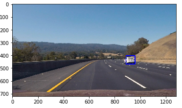
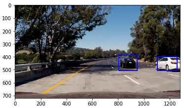
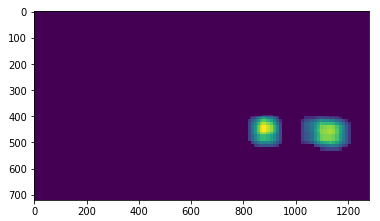

## Writeup Template
### You can use this file as a template for your writeup if you want to submit it as a markdown file, but feel free to use some other method and submit a pdf if you prefer.

---

**Vehicle Detection Project**

The goals / steps of this project are the following:

* Perform a Histogram of Oriented Gradients (HOG) feature extraction on a labeled training set of images and train a classifier Linear SVM classifier
* Optionally, you can also apply a color transform and append binned color features, as well as histograms of color, to your HOG feature vector. 
* Note: for those first two steps don't forget to normalize your features and randomize a selection for training and testing.
* Implement a sliding-window technique and use your trained classifier to search for vehicles in images.
* Run your pipeline on a video stream (start with the test_video.mp4 and later implement on full project_video.mp4) and create a heat map of recurring detections frame by frame to reject outliers and follow detected vehicles.
* Estimate a bounding box for vehicles detected.

## [Rubric](https://review.udacity.com/#!/rubrics/513/view) Points
### Here I will consider the rubric points individually and describe how I addressed each point in my implementation.  

---
### Writeup / README

#### 1. Provide a Writeup / README that includes all the rubric points and how you addressed each one.  You can submit your writeup as markdown or pdf.  [Here](https://github.com/udacity/CarND-Vehicle-Detection/blob/master/writeup_template.md) is a template writeup for this project you can use as a guide and a starting point.  

You're reading it!

### Histogram of Oriented Gradients (HOG)

#### 1. Explain how (and identify where in your code) you extracted HOG features from the training images.

The code for this project is located in the IPython notebook [vehicle_detection.ipynb](https://github.com/emiranda927/CarND-Advanced-Lane-Lines/blob/master/vehicle_detection.ipynb)

The code for actually extracting HOG features is contained in the first code cell of the IPython notebook within the function `get_hog_features()`.  

I started by reading in all the `vehicle` and `non-vehicle` images.  Here is an example of one of each of the `vehicle` and `non-vehicle` classes:

I then explored different color spaces and different `skimage.hog()` parameters (`orientations`, `pixels_per_cell`, and `cells_per_block`).  I grabbed random images from each of the two classes and displayed them to get a feel for what the `skimage.hog()` output looks like.

Here is an example using the `YCrCb` color space and HOG parameters of `orientations=9`, `pixels_per_cell=(8, 8)` and `cells_per_block=(2, 2)`:

#### 2. Explain how you settled on your final choice of HOG parameters.

Settling on HOG parameters was a matter of trial and error. Changing the HOG parameters from the default values from the lessons didn't do much to improve performance. In the end, changing the orientations from 8 to 9 was the only big change I made. Changing the HOG channel from "ALL" vastly reduced the performance of the classifier (but increased speed) and was ultimately not worth the gain in speed.

Changing the spatial binning dimensions and the number of histogram bins for spatial and color feature extraction had the most dramatic effect on performance. Increasing the spatial size from 16x16 to 32x32 slowed down the classifier but vastly improved the quality of the final product. 

I would like future implementations of this pipeline to be optimized for speed without sacrificing performance.

#### 3. Describe how (and identify where in your code) you trained a classifier using your selected HOG features (and color features if you used them).

I trained a linear SVM using...

### Sliding Window Search

#### 1. Describe how (and identify where in your code) you implemented a sliding window search.  How did you decide what scales to search and how much to overlap windows?

I modified the `find_cars()` function from the lessons to implement a scaled sliding window based on image location. The further away from the bottom of the image, the smaller the sliding window. These windows overlapped some to make sure that there were no missed classification areas. I also subsampled the image to only search below the horizon line. Here are some examples of raw, classified detections using this window search

#### 2. Show some examples of test images to demonstrate how your pipeline is working.  What did you do to optimize the performance of your classifier?

Ultimately I searched on two scales using YCrCb 3-channel HOG features plus spatially binned color and histograms of color in the feature vector, which provided a nice result.  Here are some example images:

---

### Video Implementation

#### 1. Provide a link to your final video output.  Your pipeline should perform reasonably well on the entire project video (somewhat wobbly or unstable bounding boxes are ok as long as you are identifying the vehicles most of the time with minimal false positives.)
Here's a [link to my video result](./out_video.mp4)

#### 2. Describe how (and identify where in your code) you implemented some kind of filter for false positives and some method for combining overlapping bounding boxes.

I recorded the positions of positive detections in each frame of the video.  From the positive detections I created a heatmap and then thresholded that map to identify vehicle positions.  I then used `scipy.ndimage.measurements.label()` to identify individual blobs in the heatmap.  I then assumed each blob corresponded to a vehicle.  I constructed bounding boxes to cover the area of each blob detected.  

Here's an example result showing the heatmap from a series of frames of video, the result of `scipy.ndimage.measurements.label()` and the bounding boxes then overlaid on the last frame of video:

### Here are is a sample heatmap with threshold applied:

### Here the resulting bounding boxes are drawn onto the last frame in the series:

---

### Discussion

#### 1. Briefly discuss any problems / issues you faced in your implementation of this project.  Where will your pipeline likely fail?  What could you do to make it more robust?

There were a few issues I faced while completing this pipeline. The first, most obvious issue, was one where the bounding boxes were jumping and changing sizes dramatically through every frame of the video. In order to combat this, I implemented a `Bbox()` class that tracked the last ~20 frames worth of detections, and averaged them together. This smoothed out the frames and kept a more constant bounding box under the assumption that the vehicle shape, size, position shouldn't change dramatically from frame to frame. This did come with the drawback of a "lagging" effect. Because the vehicles are moving through the video stream, averaging the detections together often caused the resulting box to lag a bit behind the centroid of the vehicle. I had to compromise between this performance and smooth classifications.

The next major issue came in the form of not detecting the entire vehicle and focusing towards the back. I surmise that this is the result of two things.

1) The training images used in the classifier seemed biased towards the rear of vehicles, causing the centroid of the detections to shift towards the back of the car.

2) The number of detections on the edge of the classified heatmap are much less those near the centroid. Because of the use of thresholding, this removed the detections on the boundary of the sliding window detections, shrinking the heatmap.

In future implementations, I would like to find ways to diversify the training set a bit, or use other methods of classification, such as a convolutional nueral network. As far as the second point above, I found that deciding how much I should threshold the heatmap to avoid false detections and subsequently reduce the size of the bounding box was a design decision. I used an iterative approach to land on the most appropriate threshold value here.
